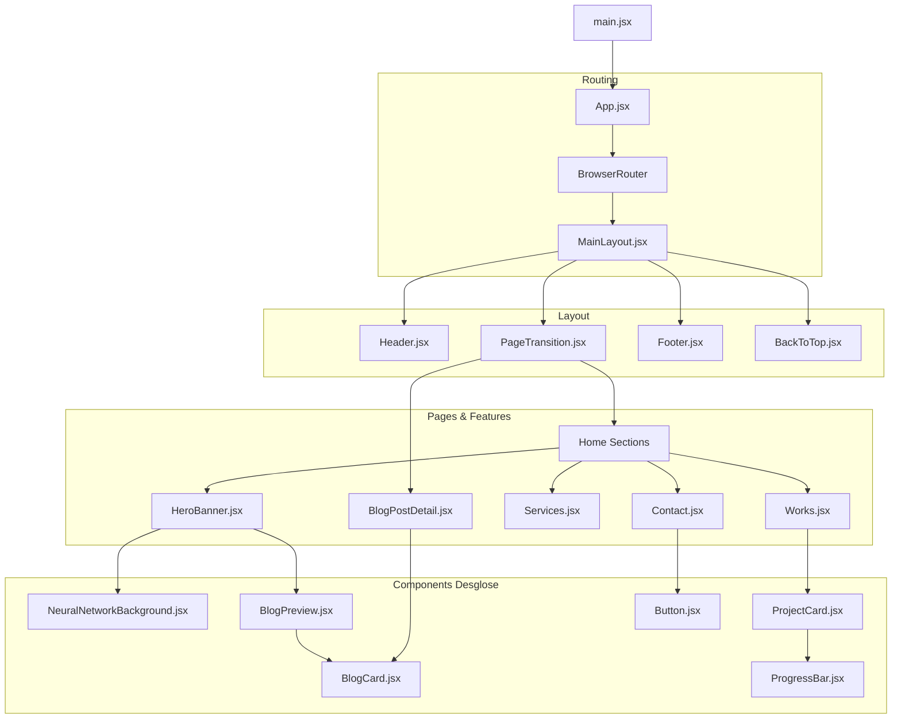

# 🌳 Árbol de Componentes

Este mapa refleja la jerarquía real de renderizado de la aplicación.

## 📦 Leyenda
- **Layouts**: Estructuran el contenido global.
- **Features**: Módulos funcionales grandes.
- **UI Components**: Componentes visuales pequeños y reutilizables.
